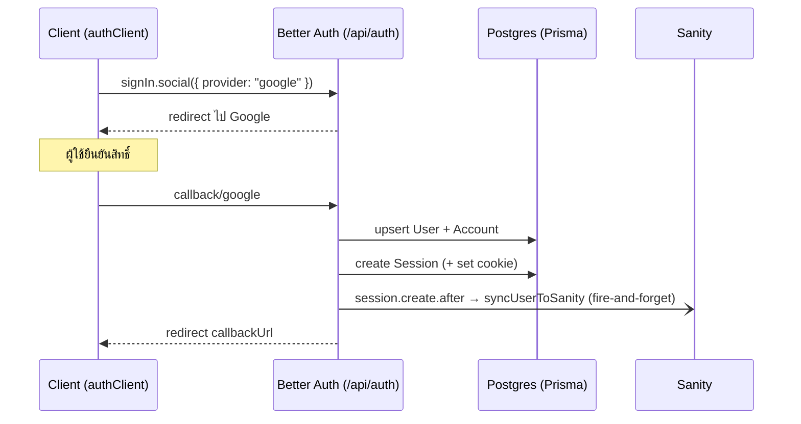
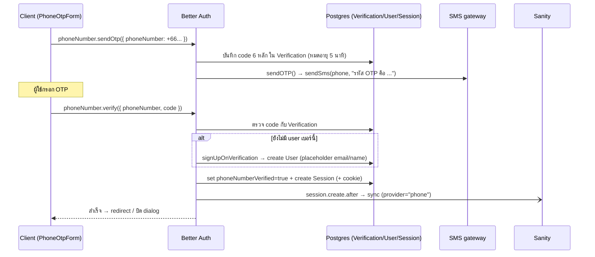
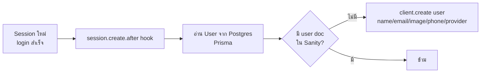

# Authentication Flow — CampMooCampMee

เอกสารอธิบายระบบ authentication ของโปรเจกต์ และบทบาทของ **Supabase Postgres**, **Prisma**, และ **Sanity** ว่าทำงานร่วมกันอย่างไร

> สรุปสั้น: **Postgres = ตัวจริงของ auth**, **Prisma = ตัวกลาง/ORM + migration**, **Sanity = สำเนา (mirror) ของ user ฝั่ง CMS** — auth ไม่เคยพึ่ง Sanity (sync เป็น best-effort)

---

## 1. บทบาทของแต่ละระบบ

| ระบบ | บทบาท | เก็บอะไร |
|------|-------|---------|
| **Supabase Postgres** | Source of truth ของ auth | ตาราง `User`, `Session`, `Account`, `Verification` |
| **Prisma** | ORM + adapter เชื่อม Better Auth ↔ Postgres + จัดการ migration | schema/migration (ไม่เก็บข้อมูลเอง) |
| **Sanity** | Mirror ของ user ไว้ใน CMS ให้ content (รีวิว/ลาน) อ้างอิงได้ | document `user` (สำเนา) |
| **Better Auth** | Auth framework — ออก endpoint, จัดการ session/OTP/OAuth | — |

---

## 2. ไฟล์ที่เกี่ยวข้อง

| ไฟล์ | หน้าที่ |
|------|--------|
| `src/lib/auth.ts` | Server config: `betterAuth()` + Google provider + `phoneNumber` plugin + Sanity sync hook |
| `src/lib/auth-client.ts` | Client: `authClient.useSession()` / `signIn.social()` / `phoneNumber.*` |
| `src/app/api/auth/[...all]/route.ts` | Route handler — `toNextJsHandler(auth)` รับทุก `/api/auth/*` |
| `src/lib/prisma.ts` | Prisma client (singleton) ต่อ Postgres |
| `prisma/schema.prisma` | Schema ตาราง auth |
| `src/lib/sms.ts` | ส่ง OTP ผ่าน SMS gateway ไทย (abstraction) |
| `src/lib/phone.ts` | normalize เบอร์เป็น E.164 (`toE164TH`) |
| `src/sanity/client.ts` | Sanity write client (มี token) |
| `src/components/PhoneOtpForm.tsx` | UI login เบอร์โทร 3 ขั้น |
| `src/components/UserDialog.tsx` | Dialog login (Google + phone) |
| `src/app/account/page.tsx` | หน้า "บัญชีของฉัน" |

---

## 3. Environment variables

```bash
# Better Auth
BETTER_AUTH_SECRET=...
BETTER_AUTH_URL=...
GOOGLE_CLIENT_ID=...
GOOGLE_CLIENT_SECRET=...

# Postgres (Supabase) — ผ่าน Prisma
DATABASE_URL=postgresql://...@...pooler.supabase.com:6543/postgres?pgbouncer=true  # runtime (pooled)
DIRECT_URL=postgresql://...@...pooler.supabase.com:5432/postgres                   # migrate (direct)

# SMS OTP (ถ้าไม่ตั้ง → log OTP ลง console ตอน dev)
SMS_API_URL=...
SMS_API_TOKEN=...
SMS_SENDER=...

# Sanity (write)
SANITY_API_TOKEN=...
NEXT_PUBLIC_SANITY_DATASET=develop|production
```

> ⚠️ **dev กับ prod เป็นคนละ Supabase project** → migration ต้อง deploy แยกแต่ละ DB

---

## 4. ตารางใน Postgres (Better Auth schema)

| ตาราง | ความหมาย | ฟิลด์สำคัญ |
|-------|---------|-----------|
| **User** | ตัวตนผู้ใช้ | `id`, `name`, `email` (unique), `emailVerified`, `image`, `phoneNumber` (unique), `phoneNumberVerified` |
| **Account** | credential ต่อ provider | `accountId`, `providerId` (เช่น `"google"`), `userId`, `password?` |
| **Session** | session ที่ active | `token` (unique), `expiresAt`, `userAgent`, `ipAddress`, `userId` |
| **Verification** | OTP / token ยืนยัน | `identifier` (เบอร์/อีเมล), `value` (code), `expiresAt` |

- Session: อายุ **15 วัน**, refresh ทุก **1 ชั่วโมง** ที่มี activity
- OTP เบอร์โทร: เก็บใน **Verification**, อายุ **5 นาที**, ลองผิดได้ **3 ครั้ง**

---

## 5. Flow 1 — Login ด้วย Google



1. กดปุ่ม → `authClient.signIn.social({ provider: "google" })`
2. redirect ไป Google → กลับมาที่ `/api/auth/callback/google`
3. Better Auth (ผ่าน Prisma) สร้าง/อัปเดต `User` + `Account`, สร้าง `Session` + เซ็ต cookie
4. hook `session.create.after` ยิง → sync เข้า Sanity (ไม่บล็อก redirect)
5. redirect กลับหน้าเดิม

---

## 6. Flow 2 — Login ด้วยเบอร์โทร + OTP



1. กรอกเบอร์ → `authClient.phoneNumber.sendOtp()` → Better Auth สร้างรหัส 6 หลัก เก็บใน `Verification` แล้วเรียก `sendOTP` → `sendSms()` (gateway ไทย หรือ log console ตอน dev)
2. กรอก OTP → `authClient.phoneNumber.verify()` → Better Auth เทียบรหัส
3. ผ่าน + ยังไม่มี user เบอร์นี้ → `signUpOnVerification` สร้าง `User` ใหม่ เติม email/name เป็น placeholder `<digits>@phone.campmoocampmee.com`
4. ตั้ง `phoneNumberVerified=true` → สร้าง `Session` + cookie
5. hook sync เข้า Sanity → client redirect / ปิด dialog

> **UI**: `PhoneOtpForm.tsx` เป็น 3 ขั้น (เลือกวิธี → กรอกเบอร์ `+66` → กรอก OTP) และเก็บ resend cooldown ไว้ใน `localStorage` (นับต่อได้แม้ปิด popup)

---

## 7. การ sync เข้า Sanity (one-way mirror)



ทุกครั้งที่มี **Session ใหม่** hook `databaseHooks.session.create.after` (ใน `auth.ts`) เรียก `syncUserToSanity(userId)`:

1. อ่าน user จาก **Postgres** (Prisma)
2. เช็คใน **Sanity** ว่ามี doc `user` ที่ match เบอร์/อีเมลแล้วหรือยัง
3. ถ้ายังไม่มี → `client.create()` สร้าง document ใหม่

**หลักออกแบบ:**
- **ทิศทางเดียว** Postgres → Sanity (Sanity ไม่เขียนกลับ auth)
- **ไม่บล็อก / ไม่ throw** — หุ้ม try/catch + เรียกด้วย `void` → Sanity ล่มก็ login สำเร็จ
- **idempotent** — มี existence-check ก่อน create → login ซ้ำไม่สร้าง doc ซ้ำ, รอบที่พลาดจะ retry รอบ login ถัดไป

---

## 7.1 Authorization / identity = Postgres (ไม่พึ่ง Sanity)

สิทธิ์และตัวตนทั้งหมด resolve จาก **Postgres (source of truth)** ผ่าน
`getUserIdentity(userId)` ใน `src/server/identity.service.ts` — ไม่อ่านจาก Sanity mirror
(เพราะ sync เป็น best-effort อาจยังไม่ทันสร้าง doc):

- `getUserIdentity(userId)` → `{ provider, providerId, name, email, image, phoneNumber }`
  โดย `providerId` = Google `accountId` (ถ้าผูก Google) ไม่งั้น = `phoneNumber`
- **landowner** (posts/upload) ใช้ `getUserIdentity(session.user.id).providerId` แทนการอ่าน Sanity
- **wishlist / reviews** ที่ผูก data กับ Sanity user `_id` ใช้ `resolveSanityUserId(userId)`
  (`src/server/users.service.ts`) ซึ่ง **self-heal**: ถ้า mirror doc หาย จะ `upsertSanityUser` สร้างให้
  จาก Postgres แล้วคืน `_id` → ฟีเจอร์ไม่พังเพราะ sync พลาด

> เดิมใช้ `getProviderIdByEmail` / `getSanityUserIdByEmail` ที่อ่าน Sanity แล้วโยน 404 ถ้า doc หาย
> (ลบออกแล้ว) — ย้ายมาอิง Postgres เพื่อตัด coupling กับ CMS

---

## 7.2 Account linking policy

**แต่ละวิธี login = คนละ identity** เว้นแต่ผูกกันอย่างชัดเจน:

- **Google ↔ Google**: บัญชีเดียวกัน (ตาม Google `accountId`)
- **Phone ↔ Phone**: บัญชีเดียวกัน (ตาม `phoneNumber`)
- **Google auto-link**: `account.accountLinking` เปิด `trustedProviders: ["google"]` +
  `allowDifferentEmails=false` (default) → login Google จะผูกเข้า user เดิม **เฉพาะเมื่ออีเมลตรงกัน**
  (Google verify อีเมลแล้ว ปลอดภัย, กันบัญชี Google ซ้ำ)
- **Phone + Google ของคนเดียวกัน**: **ไม่ auto-merge** — เบอร์โทรใช้ placeholder email
  (`<digits>@phone.campmoocampmee.com`) ไม่มีวันตรงกับ Gmail จริง และไม่มี identifier ร่วม
  การ merge อัตโนมัติจึงไม่ปลอดภัย → ถ้าจะรวมต้องทำเป็น manual linking + จัดการ conflict (แยก feature)

---

## 8. การอ่าน session

| ที่ใช้ | วิธี |
|--------|-----|
| Client component | `authClient.useSession()` → ยิง `/api/auth/get-session` |
| Server (API route / RSC) | `auth.api.getSession({ headers })` |

ทั้งสองทางอ่าน `Session` + `User` จาก **Postgres** ผ่าน Prisma

**Logout**: `authClient.signOut()` → ลบ Session row + cookie (ดู `account/page.tsx` ที่ reset zustand stores ด้วย)

---

## 9. Migration & Deployment

- **Local/dev**: `pnpm prisma migrate dev` (ใช้ `DIRECT_URL` ของ dev DB)
- **Production**: รัน `prisma migrate deploy` กับ prod DB
  - อัตโนมัติบน Vercel ผ่าน `scripts/prod-migrate.mjs` ที่เช็ก `VERCEL_ENV === "production"` (preview/local ข้าม)
  - build script: `node scripts/prod-migrate.mjs && next build`
  - **ต้องมี `DIRECT_URL` ใน Vercel env (Production)**

> ⚠️ Postgres pooler (`migrate dev` ที่ใช้ shadow DB) เข้ากันไม่ได้กับ Supabase pooler — ถ้าต้องสร้าง migration ใหม่ ให้เขียน SQL เองใน `prisma/migrations/<ts>_<name>/migration.sql` แล้วใช้ `migrate deploy`

---

## 10. Troubleshooting

| อาการ | สาเหตุ | วิธีแก้ |
|-------|--------|--------|
| `/api/auth/get-session` 500 | prod DB schema ไม่ตรงกับ Prisma client (เช่น คอลัมน์ใหม่ยังไม่ migrate) | `prisma migrate deploy` กับ prod DB |
| OTP ไม่เข้ามือถือ | ไม่ได้ตั้ง `SMS_API_*` หรือ payload ไม่ตรง provider | เช็ก env + map payload ใน `sms.ts`; dev จะ log OTP ลง console |
| user ไม่โผล่ใน Sanity | sync เป็น best-effort, อาจ error เงียบ | ดู log `"Sanity sync error"`; login ใหม่จะ retry |
| login Google ไม่ได้ใน Facebook/Line | in-app browser ไม่รองรับ OAuth | UI มี fallback ให้ copy ลิงก์ไปเปิด Safari/Chrome |

> เหตุการณ์จริง: เคยเกิด get-session 500 บน prod เพราะ migration `add_phone_number` ถูก apply แค่ dev DB — Prisma query คอลัมน์ `phoneNumber` ที่ prod ยังไม่มี → query พัง แก้ด้วยการ `migrate deploy` กับ prod (ดูข้อ 9)
